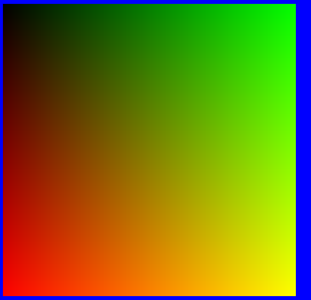

Assignment 01 - Getting Started with Render Buffers in HTML5
=============
### Requirements

* Create an HTML page that uses an HTML5 canvas object, creates an ImageData object from its context, and populates an image on a square canvas that is 600x600 pixels and has a gradient.
* Make the gradient black in the upper left corner, green in the upper right, red in the lower left, and yellow in the lower right corner.
* Do NOT use any other canvas operations besides using an ImageData object and assigning its data pixel for pixel.
* Be sure the colors are completely saturated in the corners (watch out for one-off errors).
* Create a function for setting the color of a pixel given its x and y coordinates and r, g, b, a values, e.g., function setPixel(imageData, x, y, r, g, b, a)

### Sample Image

### Experiment

Make another canvas that has some kind of animation based on a real clock milliseconds since the page was last refreshed. Do something fun with it.

### More Instructions

1. Use one Canvas that is clean like this one and just implements the assignment. If you want to experiment, use another Canvas.
2. Do not add any borders to the Canvas. Yours can be blue like the screenshot if you make the background of your HTML blue. Just make the canvas the right size and draw across all of it.
3. Do not add any extraneous css, javascript, or other code. Keep it clean and straightforward.
4. Try to be somewhat efficient. Do not calculate things more often than necessary and avoid division and branching inside of loops.

Also, to remind you of some clean coding practices you should already know:

1. DO NOT use magic numbers except as noted. The only magic numbers you should use are (600, 600), and perhaps the color values, and they should appear ONE TIME only.
2. Give your variables names that have meaning whenever possible. A variable like 'x' is a much better loop variable than 'i' if iterating over width.
3. Make your code clean and easy to read with proper indenting.

### References

[http://www.w3schools.com/html/html5_intro.asp](http://www.w3schools.com/html/html5_intro.asp)

[http://www.w3schools.com/html/html5_canvas.asp](http://www.w3schools.com/html/html5_canvas.asp)

[http://www.w3schools.com/tags/canvas_createimagedata.asp](http://www.w3schools.com/tags/canvas_createimagedata.asp)

[http://www.html5canvastutorials.com/advanced/html5-canvas-animation-stage/](http://www.html5canvastutorials.com/advanced/html5-canvas-animation-stage/)

[http://www.w3schools.com/js/js_obj_date.asp](http://www.w3schools.com/js/js_obj_date.asp)

### Self-Assessment

What is true?

* I made an attempt at a solution.
* What's more, I noted what parts I may have struggled with and why I think it might not be working.
* What's more, I got code running, but maybe not error-free.
* What's more, I got code running, and it's error-free.
* What's more, my running error-free code meets most requirements.
* What's more, my running error-free code meets all requirements.
